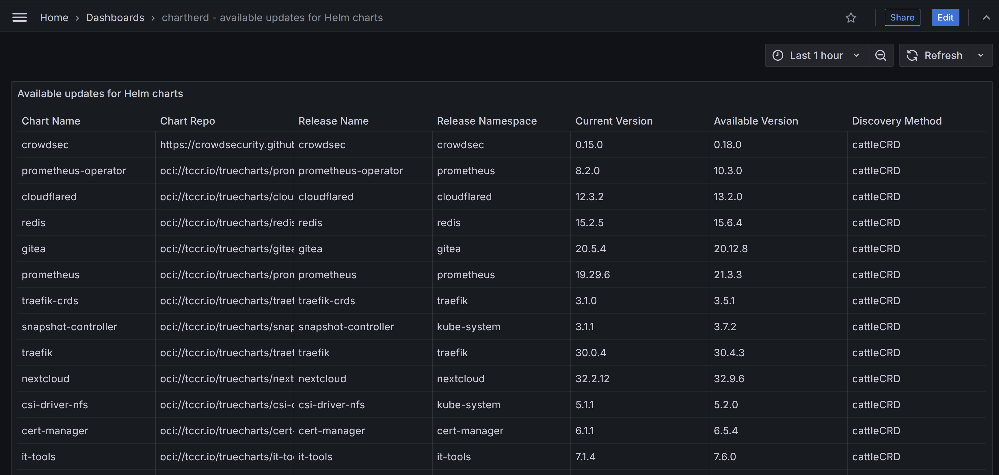

[](https://goreportcard.com/report/github.com/evgeny-terekhov/chartherd)


# Overview
`chartherd` is a tool for checking whether the Helm charts installed in your Kubernetes cluster have updates. It can either perform one-time checks or run continiously exposing the available chart updates as Prometheus metrics which in turn can be displayed in a Grafana dashboard/table.

I made this tool to scratch a very specific itch: as a self-hosting enthusiast I run a [k3s](https://k3s.io/) cluster at home with a lot of applications installed from [TrueCharts](https://truecharts.org/) repo. After a certain point keeping those up-to-date became quite a chore, and the existing solutions like [nova](https://github.com/FairwindsOps/nova) did not fit my setup.

At the time `chartherd` works best with charts installed via [k3s Helm Controller](https://docs.k3s.io/helm) (simply because because it is my pimary use case). Charts installed using the 'classic' `helm install` way are supported too, but finding the source respository for such charts can be tricky. You can supply your `repositories.yaml` file as an input and `chartherd` will look for chart updates in every repo from it. Helm repositories that require authorization are not supported yet.

The name `chartherd` is supposed to be a pun: k3s Helm Controller API group is named `helm.cattle.io`, and the tool is like a shepherd for its objects.

# Usage
## One-time checks
All charts in all namespaces, output as a table
```shell
export KUBECONFIG=/path/to/kubeconfig
chartherd
```

https://github.com/user-attachments/assets/b906f0ca-df8d-485d-bbb6-cab592a6fa27

Charts in a single namespace, use local `repositories.yaml` file, include all chart versions, output as JSON
```shell
export KUBECONFIG=/path/to/kubeconfig
chartherd --namespace {NAMESPACE_NAME} --include-all --use-local-helm-repos --output json
```

https://github.com/user-attachments/assets/82739f4f-7a3d-4abd-92cd-e5b4d52bc841

The logs are sent to `stderr` so it's safe to use the output in a pipe.

## Running in a Kubernetes cluster
This approach implies that you have a running Kubernetes cluster with Prometheus, Prometheus Operator and Grafana installed.

Download the manifest
```shell
curl -L https://raw.githubusercontent.com/evgeny-terekhov/chartherd/refs/tags/v1.0.0/deploy/chartherd-with-servicemonitor.yaml -o chartherd-with-servicemonitor.yaml
```
Open it with your favorite text editor for inspection (you don't just apply unknown manifests to your Kubernetes clusters, do you?), edit it to fit your requirements if needed.

Deploy `chartherd` to the cluster
```shell
kubectl create -f chartherd-with-servicemonitor.yaml
```

Import the dashboard from [the JSON file](deploy/chartherd-grafana-dashboard.json) to Grafana.



# Configuration
| CLI argument | Environment variable | Default value | Description |
| ------------ | -------------------- | ------------- | ----------- |
| `--include-all` | `CHARTHERD_INCLUDE_ALL` | `false` | Whether to report all Helm charts instead of only the ones that have an update. |
| `--namespace <string>` | `CHARTHERD_NAMESPACE` | `""` (all namespaces) | Limit the checks to releases in a single namespace. If not set, all namespaces will be checked for Helm releases. |
| `--kubeconfig <string>` | `CHARTHERD_KUBECONFIG`, `KUBECONFIG` | `$HOME/.kube/config` | Path to the kubeconfig file. Ignored if chartherd is running in a Kubernetes cluster. |
| `--kubeconfig-context <string>` | `CHARTHERD_KUBECONFIG_CONTEXT` | `"default"` | Kubeconfig context to use. Ignored if chartherd is running in a Kubernetes cluster. |
| `--daemon` | `CHARTHERD_DAEMON` | `false` | Run continuously in the foreground. If not set and chartherd runs outside of a Kubernetes cluster, it will execute once and exit. |
| `--interval` | `CHARTHERD_INTERVAL` | `1h` | Check interval when running in daemon mode. |
| `--metrics-enabled` | `CHARTHERD_METRICS_ENABLED` | `false` | Whether to export the resulting output as Prometheus metrics. |
| `--metrics-http-bind-to <string>` | `CHARTHERD_METRICS_HTTP_BIND_TO` | `":9420"` | IP address and TCP port to bind the metrics exporter to in [HOST]:PORT format. |
| `--metrics-route <string>` | `CHARTHERD_METRICS_ROUTE` | `"/metrics"` | HTTP route for the metrics exporter. |
| `--output <table\|json\|none>` | `CHARTHERD_OUTPUT` | `"table"` | Output format of the results. |
| `--concurrent-requests <int>` | `CHARTHERD_CONCURRENT_REQUESTS` | `10` | Limit the number of concurrent Helm releases being checked and by extension the number of concurrent HTTP requests sent to repos/registries. |
| `--check-chart-deps` | `CHARTHERD_CHECK_CHART_DEPS` | `false` | If a chart's source repo cannot be determined, try looking for it in its dependencies repos. |
| `--use-local-helm-repos` | `CHARTHERD_USE_LOCAL_HELM_REPOS` | `false` | Use Helm repositories data (`repositories.yaml`) from the local machine. Please note that every repo from the file might be queried for any installed chart, so be cautious about potential rate limiting and leaking your installed chart names. If the application is run in a Kubernetes cluster, the repositories file can be mounted to the Pod as a Volume. |
| `--helm-repos-path <string>` | `CHARTHERD_HELM_REPOS_PATH` | `$HOME/.config/helm/repositories.yaml` | Path to Helm repositories data (repositories.yaml) on the local machine. If the application is run in a Kubernetes cluster, make sure the file is mounted as a Volume. |
| `--debug` | `CHARTHERD_DEBUG` | `false` | Enable debug logging. |

# TODO
- [x] Prometheus metrics and Grafana dashboard
- [ ] Configuration via a config file
- [ ] Allow a user to add pre-defined well-known source repos for certain charts via the config file
- [ ] Add support for repos with authorization
- [ ] Add support for checking updates for container images too
- [ ] Tests
- [ ] Maybe leverage the API verb 'watch' somehow?
- [ ] Implement kube-insecure-skip-tls-verify for Kube-API and insecure-skip-tls-verify for chart repo/registry fetches
- [ ] Deployment via a Helm chart
- [ ] Check charts that are installed using PgSQL Helm backend

# Known issues
A small goroutine leak is present for a few minutes after fetching tags from repos/registries. This is most likely caused by HTTP connections not being explicitly closed and living in the keep-alive mode. I think it's solvable by implementing custom functions for HTTP requests that can leverage context, along with some fancy optimizations like using one connection per target host.
